# Kubernetes Monitoring With Prometheus
A step-by-step guide to setting up Prometheus on a Kubernetes cluster using Helm.

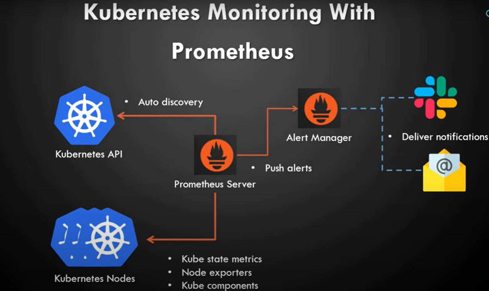

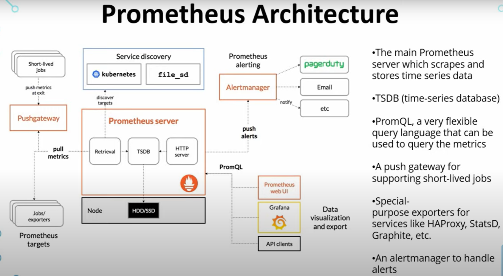


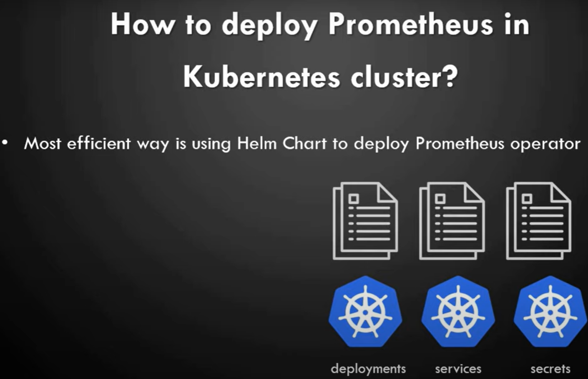
## Overview
Prometheus, part of the Cloud Native Computing Foundation (CNCF), is a powerful systems and service monitoring tool. It collects metrics from specified targets at designated intervals, evaluates rule expressions, and can trigger alerts when certain conditions are met. With the help of Helm, you can easily deploy Prometheus to your Kubernetes cluster.

## Prerequisites
- Kubernetes 1.19+
- Helm 3.7+

## Setting Up

### 1. Download Helm
```
curl -fsSL -o get_helm.sh https://raw.githubusercontent.com/helm/helm/main/scripts/get-helm-3

```

### 2. Install Helm

```
chmod 700 get_helm.sh
./get_helm.sh
```
### 3. Add Prometheus Repository to Helm

```
helm repo add prometheus-community https://prometheus-community.github.io/helm-charts
```

```
helm repo update
```
See helm repository for command documentation.

Note: You can see the helm repository for additional command documentation.

### 4. Install Prometheus Chart
Starting with version 16.0, the Prometheus chart requires Helm 3.7+. Make sure to check your Helm version before installation.

```
helm install [RELEASE_NAME] prometheus-community/prometheus
```

### 5. Validate Deployment

#### Check the pods:
```
kubectl get pods
```
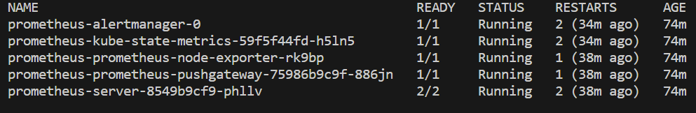

#### Check all resources:
```
kubectl get all
```
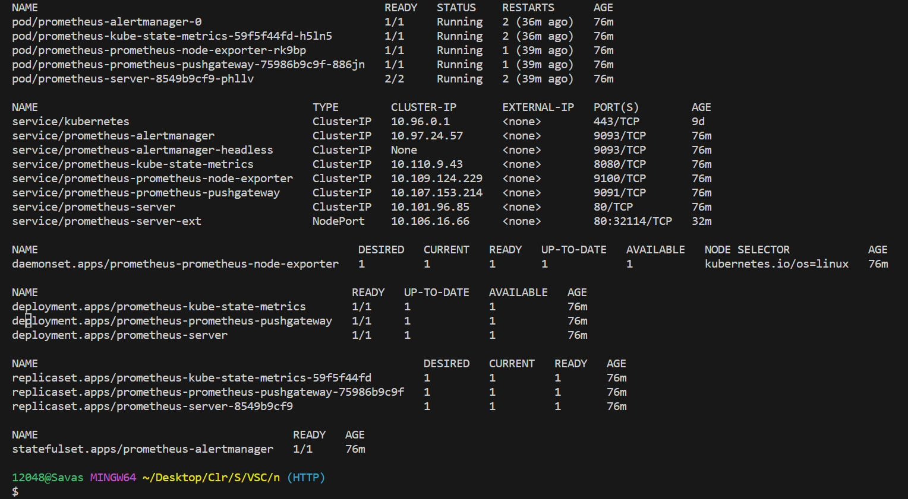

#### Verify services:
```
kubectl get services
```
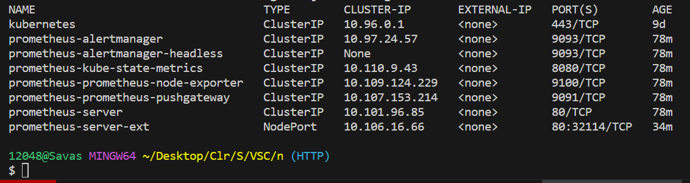

### 6. Expose Prometheus Server
```
kubectl expose service prometheus-server --type=NodePort --target-port=9090 --name=prometheus-server-ext
```
```
minikube service prometheus-server-ext
```
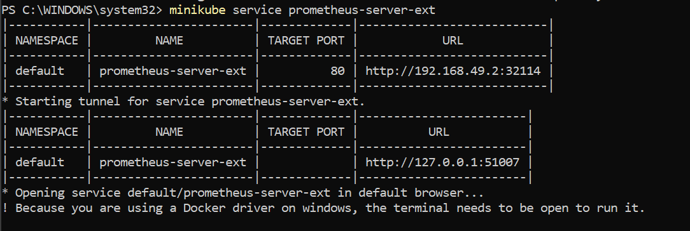


### 7. Access Prometheus Dashboard
#### Prometheus main dashboard:
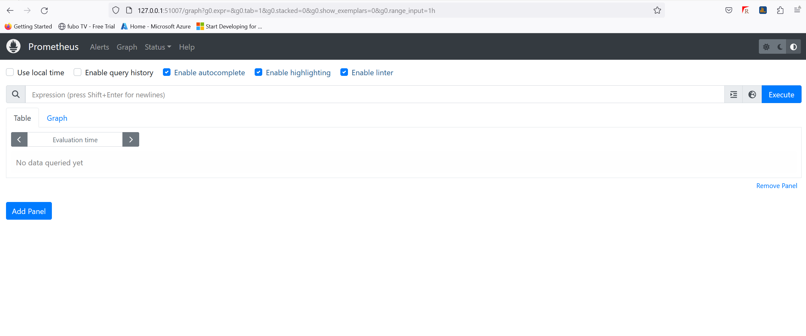

#### Targets dashboard:
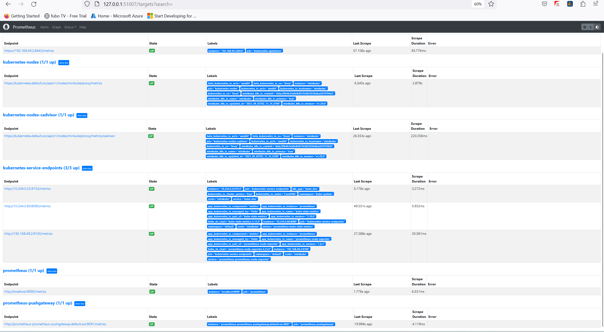

#### Metrics dashboard:
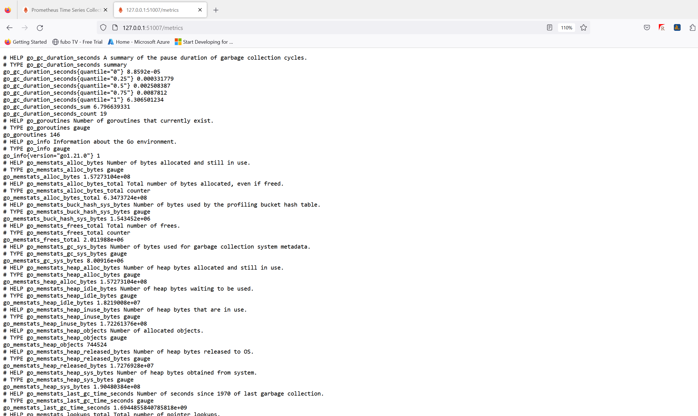

#### Graph for "node_cpu_seconds_total":
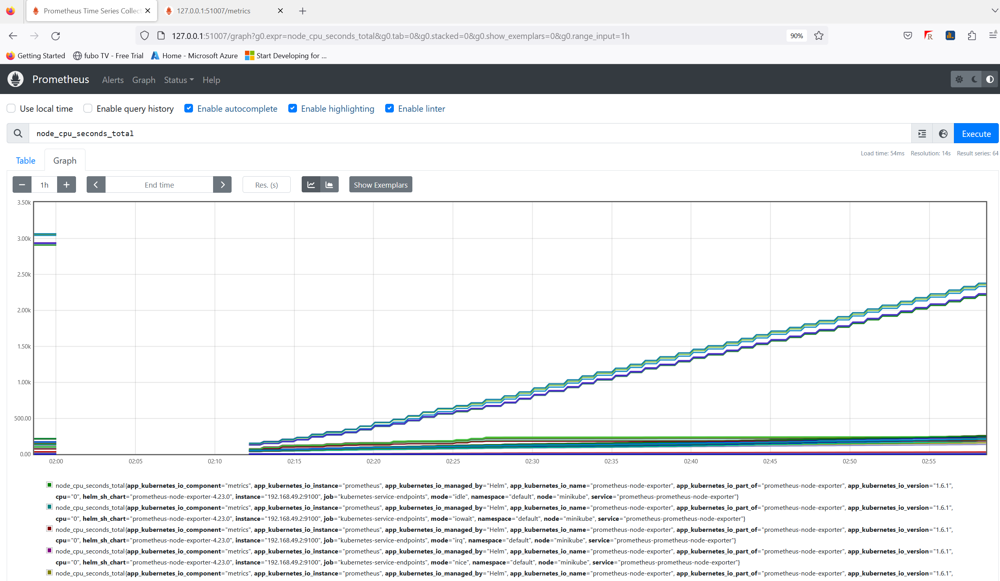

#### Graph for "node_disk_discard_time_seconds_total":

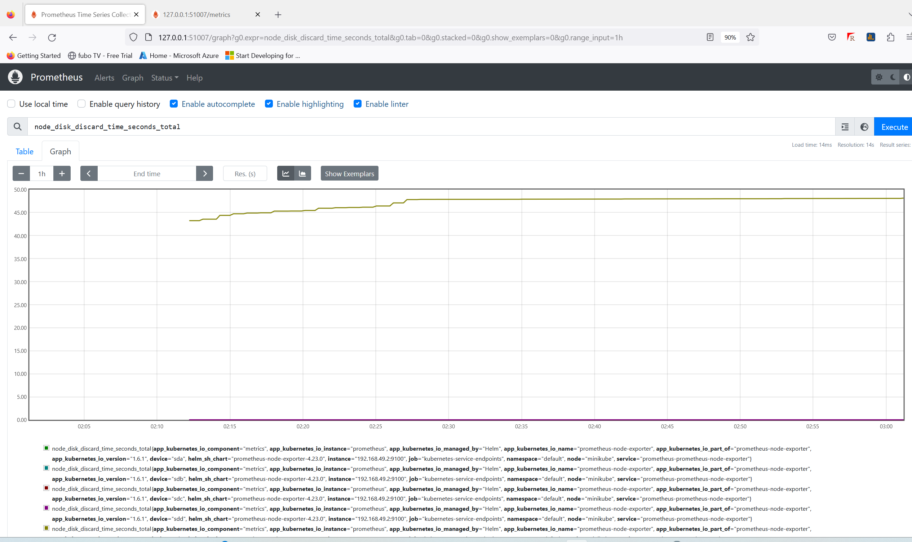

#### Configuration details:

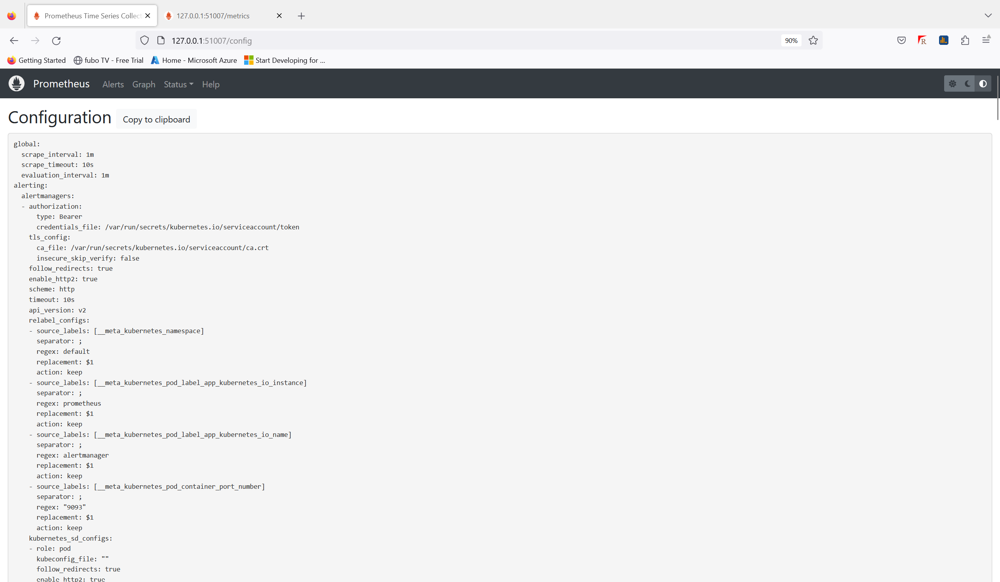

## Containers
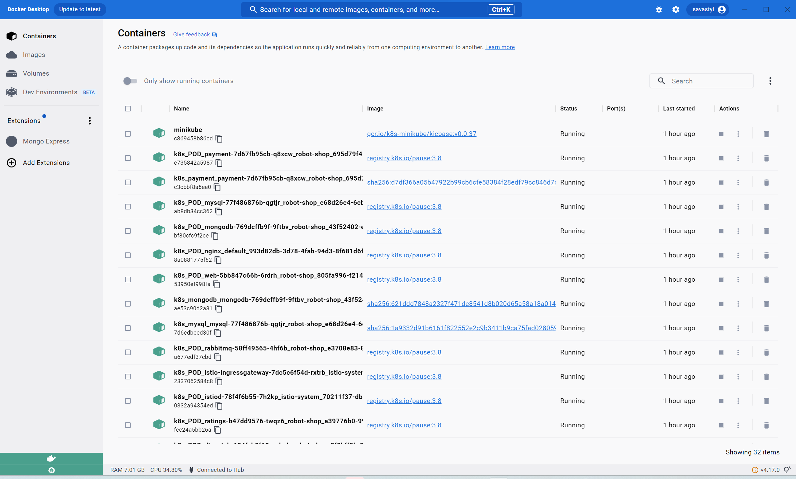


## Conclusion
With the provided steps, you have now successfully set up Prometheus on a Kubernetes cluster using Helm. Explore the dashboard, configure alerts, and monitor the health of your systems seamlessly.
